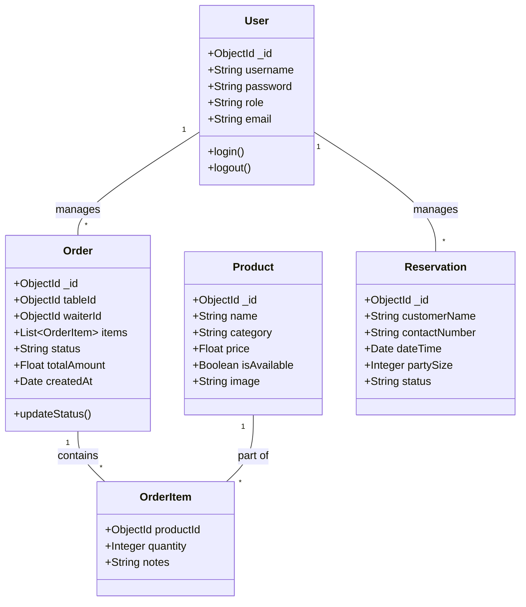
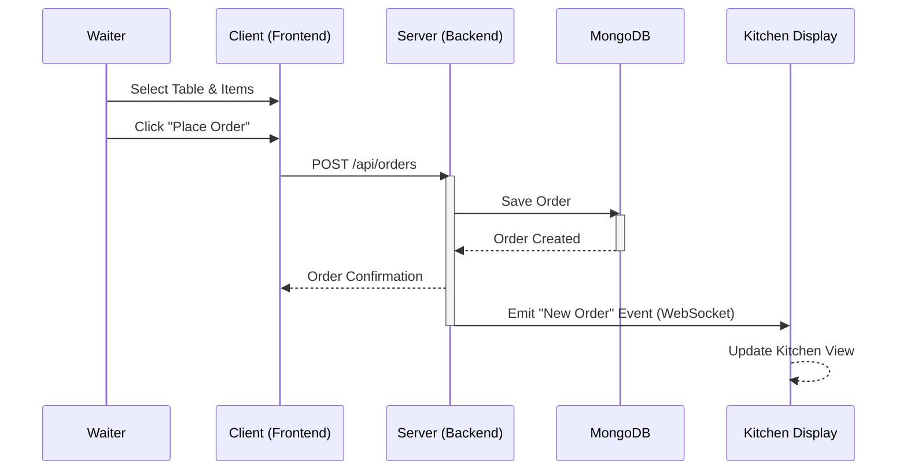
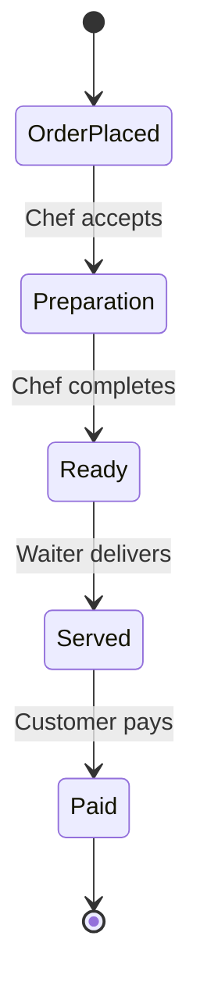
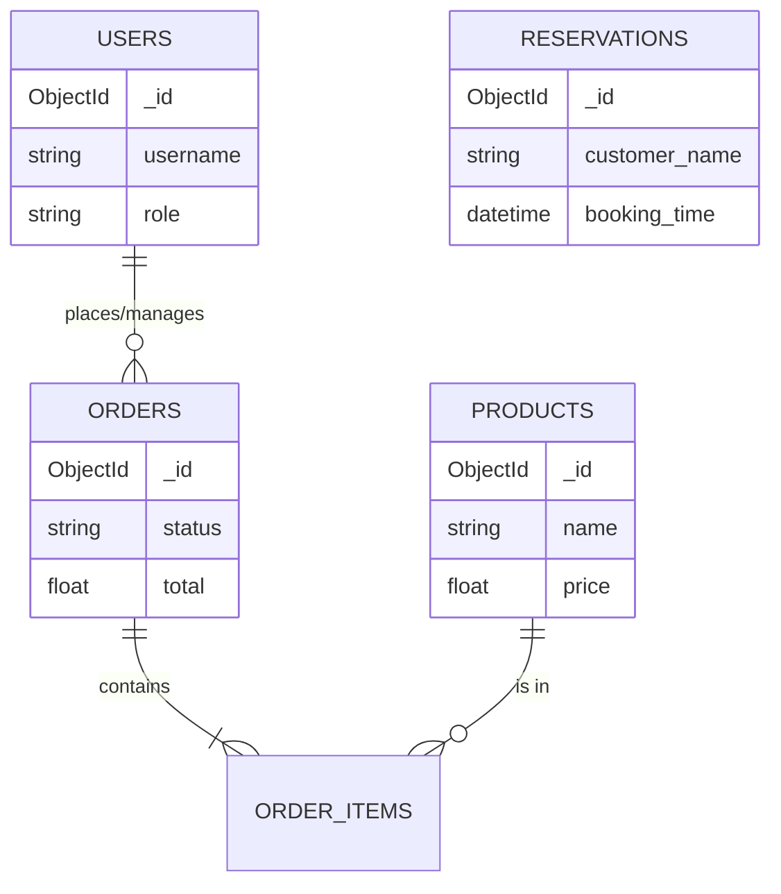

# Restaurant Management System - UML Diagrams

This document contains the UML diagrams representing the architecture and workflows of the Restaurant Management System.

## 1. Use Case Diagram
Visualizes the actors and their interactions with the system.

```mermaid
usecaseDiagram
    actor "Customer" as C
    actor "Waiter" as W
    actor "Chef" as K
    actor "Admin" as A

    package "Restaurant Management System" {
        usecase "View Menu" as UC1
        usecase "Place Order" as UC2
        usecase "Make Reservation" as UC3
        usecase "Manage Orders" as UC4
        usecase "Update Order Status" as UC5
        usecase "Manage Menu" as UC6
        usecase "Manage Staff" as UC7
        usecase "View Reports" as UC8
    }

    C --> UC1
    C --> UC3
    
    W --> UC1
    W --> UC2
    W --> UC4
    
    K --> UC5
    
    A --> UC6
    A --> UC7
    A --> UC8
    
    UC2 .> UC1 : include
```

## 2. Class Diagram
Represents the static structure of the database entities and their relationships.



## 3. Sequence Diagram (Order Flow)
Shows the sequence of interactions when a waiter places an order.



## 4. Activity Diagram (Order Lifecycle)
Illustrates the flow of an order from creation to payment.



## 5. ER Diagram (Conceptual)
Shows the entity relationships in the database.


